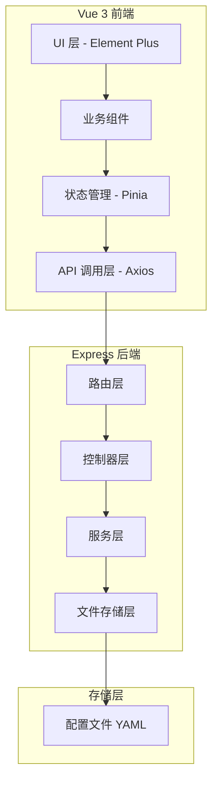
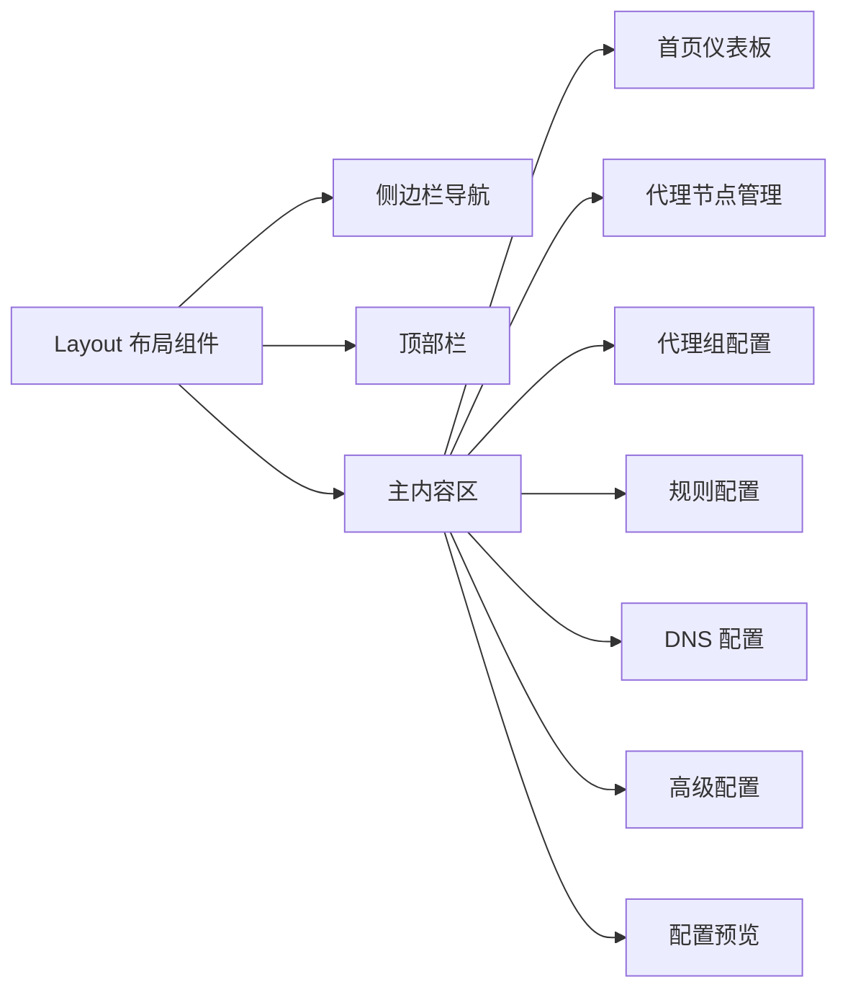
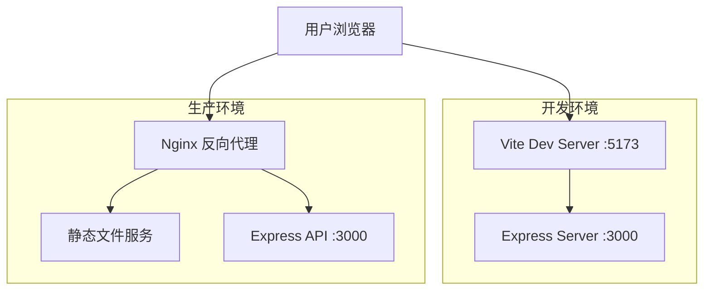

# Clash Configurator - 架构设计文档

## 1. 项目概述

一个基于 Vue 3 + Express 的 Clash 配置可视化生成和编辑器，支持完整的 Clash 配置项编辑，包括代理节点、代理组、规则、DNS 等配置的管理。

## 2. 技术选型

### 前端技术栈
| 技术 | 版本 | 用途 |
|------|------|------|
| Vue 3 | ^3.4.x | 前端框架 |
| Vite | ^5.x | 构建工具 |
| Pinia | ^2.x | 状态管理 |
| Vue Router | ^4.x | 路由管理 |
| Element Plus | ^2.x | UI 组件库 |
| js-yaml | ^4.x | YAML 解析 |
| Monaco Editor | ^0.45.x | 代码编辑器 |
| Axios | ^1.x | HTTP 客户端 |
| VueDraggable | ^4.x | 拖拽排序 |

### 后端技术栈
| 技术 | 版本 | 用途 |
|------|------|------|
| Express | ^4.x | Web 框架 |
| js-yaml | ^4.x | YAML 解析 |
| cors | ^2.x | 跨域支持 |
| multer | ^1.x | 文件上传 |
| uuid | ^9.x | 唯一 ID 生成 |

## 3. 系统架构



## 4. 目录结构

```
clash-config-gen/
├── client/                     # 前端项目
│   ├── public/
│   ├── src/
│   │   ├── api/                 # API 调用
│   │   │   ├── config.js        # 配置相关 API
│   │   │   └── index.js
│   │   ├── assets/              # 静态资源
│   │   ├── components/          # 通用组件
│   │   │   ├── common/          # 公共组件
│   │   │   ├── proxy/           # 代理节点相关组件
│   │   │   ├── proxy-group/     # 代理组相关组件
│   │   │   ├── rule/            # 规则相关组件
│   │   │   └── editor/          # 编辑器组件
│   │   ├── composables/         # 组合式函数
│   │   ├── layouts/             # 布局组件
│   │   ├── router/              # 路由配置
│   │   ├── stores/              # Pinia 状态管理
│   │   │   ├── config.js        # 配置状态
│   │   │   └── editor.js        # 编辑器状态
│   │   ├── styles/              # 全局样式
│   │   ├── utils/               # 工具函数
│   │   ├── views/               # 页面组件
│   │   │   ├── Home.vue         # 首页
│   │   │   ├── ProxyNodes.vue   # 代理节点管理
│   │   │   ├── ProxyGroups.vue  # 代理组配置
│   │   │   ├── Rules.vue        # 规则配置
│   │   │   ├── DNS.vue          # DNS 配置
│   │   │   ├── Advanced.vue     # 高级配置
│   │   │   └── Preview.vue       # 配置预览
│   │   ├── App.vue
│   │   └── main.js
│   ├── index.html
│   ├── vite.config.js
│   └── package.json
│
├── server/                      # 后端项目
│   ├── config/                  # 配置文件
│   │   └── default.yaml         # 默认配置模板
│   ├── data/                    # 数据存储目录
│   │   └── configs/             # 用户配置文件
│   ├── routes/                  # 路由
│   │   ├── config.js            # 配置相关路由
│   │   └── index.js
│   ├── services/                # 服务层
│   │   ├── configService.js     # 配置服务
│   │   ├── proxyService.js      # 代理服务
│   │   └── yamlService.js       # YAML 处理服务
│   ├── utils/                   # 工具函数
│   │   └── yaml.js              # YAML 工具
│   ├── app.js                   # Express 应用
│   └── package.json
│
├── package.json                 # 根 package.json
└── README.md
```

## 5. API 接口设计

### 5.1 配置管理 API

| 方法 | 路径 | 描述 |
|------|------|------|
| GET | /api/configs | 获取所有配置列表 |
| POST | /api/configs | 创建新配置 |
| GET | /api/configs/:id | 获取指定配置详情 |
| PUT | /api/configs/:id | 更新指定配置 |
| DELETE | /api/configs/:id | 删除指定配置 |
| POST | /api/configs/import | 导入配置文件 |
| GET | /api/configs/:id/export | 导出配置文件 |
| GET | /api/configs/:id/preview | 预览 YAML 配置 |

### 5.2 代理节点 API

| 方法 | 路径 | 描述 |
|------|------|------|
| GET | /api/configs/:id/proxies | 获取代理节点列表 |
| POST | /api/configs/:id/proxies | 添加代理节点 |
| PUT | /api/configs/:id/proxies/:proxyId | 更新代理节点 |
| DELETE | /api/configs/:id/proxies/:proxyId | 删除代理节点 |
| POST | /api/configs/:id/proxies/batch | 批量添加代理节点 |

### 5.3 代理组 API

| 方法 | 路径 | 描述 |
|------|------|------|
| GET | /api/configs/:id/groups | 获取代理组列表 |
| POST | /api/configs/:id/groups | 添加代理组 |
| PUT | /api/configs/:id/groups/:groupId | 更新代理组 |
| DELETE | /api/configs/:id/groups/:groupId | 删除代理组 |

### 5.4 Proxy Providers API

| 方法 | 路径 | 描述 |
|------|------|------|
| GET | /api/configs/:id/providers | 获取 Proxy Providers 列表 |
| POST | /api/configs/:id/providers | 添加 Proxy Provider |
| PUT | /api/configs/:id/providers/:name | 更新 Proxy Provider |
| DELETE | /api/configs/:id/providers/:name | 删除 Proxy Provider |

### 5.5 规则 API

| 方法 | 路径 | 描述 |
|------|------|------|
| GET | /api/configs/:id/rules | 获取规则列表 |
| PUT | /api/configs/:id/rules | 更新规则列表 |
| POST | /api/configs/:id/rules/validate | 验证规则格式 |

### 5.6 其他配置 API

| 方法 | 路径 | 描述 |
|------|------|------|
| GET | /api/configs/:id/dns | 获取 DNS 配置 |
| PUT | /api/configs/:id/dns | 更新 DNS 配置 |
| GET | /api/configs/:id/advanced | 获取高级配置 |
| PUT | /api/configs/:id/advanced | 更新高级配置 |

## 6. 数据模型设计

### 6.1 Clash 配置数据结构

```javascript
{
  id: String,                    // 配置 ID
  name: String,                  // 配置名称
  createdAt: Date,               // 创建时间
  updatedAt: Date,               // 更新时间
  
  // 基础配置
  port: Number,                  // HTTP 代理端口
  socks-port: Number,            // SOCKS5 代理端口
  mixed-port: Number,            // 混合端口
  allow-lan: Boolean,            // 允许局域网连接
  bind-address: String,          // 绑定地址
  mode: String,                  // 模式: rule/global/direct
  log-level: String,             // 日志级别
  
  // 代理节点
  proxies: [
    {
      id: String,                // 节点 ID（前端生成）
      name: String,              // 节点名称
      type: String,              // 类型: ss/ssr/vmess/trojan/socks5/http
      server: String,            // 服务器地址
      port: Number,              // 端口
      // ... 其他节点特定字段
    }
  ],
  
  // 代理组
  proxy-groups: [
    {
      id: String,
      name: String,
      type: String,              // select/url-test/fallback/load-balance
      proxies: Array,            // 包含的代理/组名称
      use: Array,                // 引用的 proxy-provider 名称
      // ... 其他组特定字段
    }
  ],
  
  // Proxy Providers
  proxy-providers: {
    [providerName: String]: {
      type: String,              // http 或 file
      url: String,               // HTTP 类型的订阅地址
      path: String,              // 文件路径
      interval: Number,          // 更新间隔（秒）
      'health-check': {          // 健康检查配置
        enable: Boolean,
        url: String,
        interval: Number
      }
    }
  },
  
  // 规则
  rules: [
    {
      type: String,              // DOMAIN-SUFFIX/DOMAIN-KEYWORD/IP-CIDR 等
      value: String,             // 规则值
      target: String             // 目标代理组/策略
    }
  ],
  
  // DNS 配置
  dns: {
    enable: Boolean,
    ipv6: Boolean,
    enhanced-mode: String,
    nameserver: Array,
    fallback: Array,
    // ...
  },
  
  // 其他高级配置
  sniffer: Object,
  tun: Object,
  script: Object,
  // ...
}
```

## 7. 前端组件设计

### 7.1 主要页面组件



### 7.2 核心业务组件

| 组件名 | 功能描述 |
|--------|----------|
| ProxyNodeForm | 代理节点表单（支持多种协议） |
| ProxyNodeCard | 代理节点卡片展示 |
| ProxyGroupForm | 代理组配置表单 |
| ProxyGroupCard | 代理组卡片展示 |
| ProxyProviders | Proxy Provider 管理组件 |
| ProxyProviderForm | Provider 配置表单（HTTP/File 类型） |
| RuleEditor | 规则编辑器（支持拖拽排序） |
| RuleItem | 单条规则项组件 |
| DNSError | DNS 配置表单 |
| YamlPreview | YAML 预览组件 |
| ConfigImporter | 配置导入组件 |
| ConfigExporter | 配置导出组件 |

## 8. 状态管理设计

### 8.1 Pinia Store 结构

```javascript
// stores/config.js
{
  state: {
    currentConfig: null,         // 当前编辑的配置
    configs: [],                 // 配置列表
    loading: false,
    error: null
  },
  actions: {
    async fetchConfigs(),
    async fetchConfig(id),
    async createConfig(data),
    async updateConfig(id, data),
    async deleteConfig(id),
    async importConfig(file),
    async exportConfig(id),
    
    // 代理节点操作
    addProxy(proxy),
    updateProxy(id, data),
    deleteProxy(id),
    
    // 代理组操作
    addProxyGroup(group),
    updateProxyGroup(id, data),
    deleteProxyGroup(id),
    
    // 规则操作
    updateRules(rules),
    
    // DNS 配置操作
    updateDNS(dnsConfig),
    
    // Proxy Provider 操作
    addProxyProvider(provider),
    updateProxyProvider(name, data),
    deleteProxyProvider(name),
    
    // 高级配置操作
    updateAdvanced(advancedConfig)
  }
}
```

## 9. 开发阶段规划

### 第一阶段：项目初始化
- 创建前后端项目结构
- 配置开发环境
- 搭建 Express 服务器基础框架
- 搭建 Vue 3 项目基础框架

### 第二阶段：后端核心功能
- 实现 YAML 解析和序列化工具
- 实现配置 CRUD 服务
- 实现代理节点管理服务
- 实现代理组管理服务
- 实现规则管理服务
- 实现配置导入/导出功能

### 第三阶段：前端基础框架
- 实现页面布局和路由
- 配置 Element Plus 组件库
- 实现 Pinia 状态管理
- 实现 API 调用层

### 第四阶段：核心功能模块
- 实现代理节点管理界面
- 实现代理组配置界面
- 实现规则编辑界面
- 实现 DNS 配置界面
- 实现高级配置界面

### 第五阶段：高级功能
- 实现 YAML 实时预览
- 实现配置导入功能
- 实现配置导出功能
- 实现配置验证功能

### 第六阶段：优化和测试
- 性能优化
- 错误处理优化
- 用户体验优化
- 功能测试

## 10. 部署架构



---

**文档版本**: 1.0  
**创建时间**: 2024-03-11  
**待讨论**: 是否需要添加订阅链接解析功能、节点测速功能等