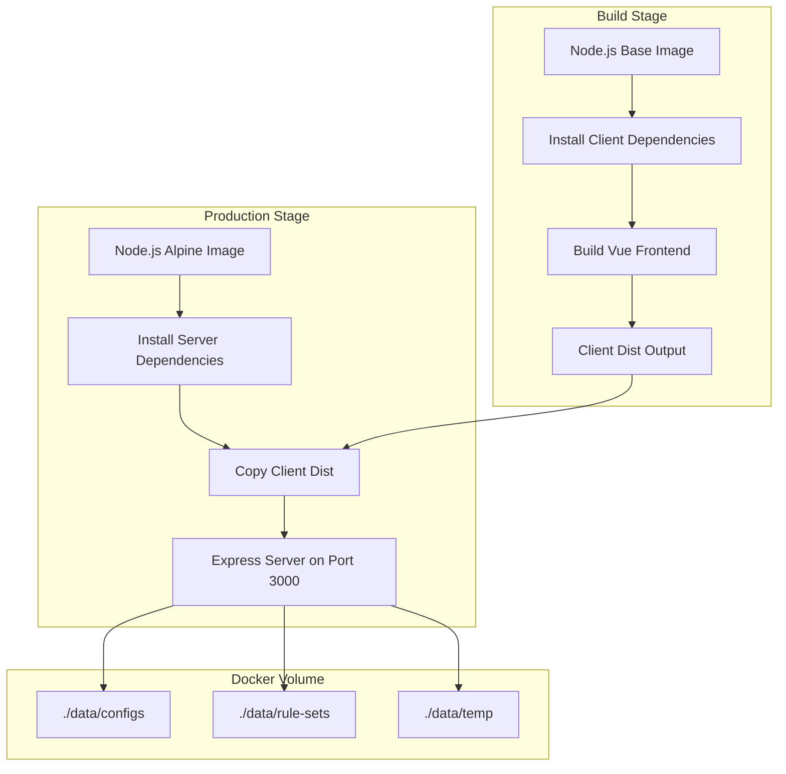

# Docker 部署方案

## 项目分析

### 技术栈
- **前端**: Vue 3 + Vite + Element Plus，构建后输出到 `client/dist`
- **后端**: Express.js，端口 3000，支持静态文件服务
- **数据存储**: 本地文件系统 (`server/data/`)

### 关键配置
- 后端端口: `3000` (可通过 `PORT` 环境变量修改)
- CORS 配置: 可通过 `CORS_ORIGIN` 环境变量配置
- 静态文件: 生产环境由 Express 服务 `client/dist` 目录

## Docker 化方案

### 架构图



### 文件结构

```
clash-config-gen/
├── Dockerfile              # 多阶段构建文件
├── .dockerignore           # Docker 构建排除文件
├── docker-compose.yml      # Docker Compose 配置
└── README.md               # 更新部署文档
```

## 详细设计

### 1. Dockerfile (多阶段构建)

```dockerfile
# 阶段1: 构建前端
FROM node:20-alpine AS frontend-builder
WORKDIR /app/client
COPY client/package*.json ./
RUN npm ci
COPY client/ ./
RUN npm run build

# 阶段2: 生产镜像
FROM node:20-alpine
WORKDIR /app
COPY server/package*.json ./server/
WORKDIR /app/server
RUN npm ci --only=production
COPY --from=frontend-builder /app/client/dist ../client/dist
COPY server/ ./
RUN mkdir -p data/configs data/rule-sets data/temp
EXPOSE 3000
CMD ["node", "app.js"]
```

**优势**:
- 使用 Alpine 镜像，体积小
- 多阶段构建，不包含前端源码和开发依赖
- 生产依赖安装，减少镜像体积

### 2. .dockerignore

```
node_modules
client/dist
server/data
*.log
.git
.idea
*.md
plans
```

### 3. docker-compose.yml

```yaml
version: '3.8'

services:
  clash-config-gen:
    build: .
    image: clash-config-gen:latest
    container_name: clash-config-gen
    ports:
      - "3000:3000"
    environment:
      - PORT=3000
      - CORS_ORIGIN=*
    volumes:
      - ./data/configs:/app/server/data/configs
      - ./data/rule-sets:/app/server/data/rule-sets
      - ./data/temp:/app/server/data/temp
    restart: unless-stopped
```

**配置说明**:
- 端口映射: `3000:3000`
- 数据持久化: 挂载本地目录到容器
- 环境变量: 配置端口和 CORS
- 重启策略: `unless-stopped`

### 4. 环境变量

| 变量名 | 默认值 | 说明 |
|--------|--------|------|
| `PORT` | 3000 | 服务端口 |
| `CORS_ORIGIN` | `*` | CORS 允许的来源 |

## 使用方式

### 构建镜像
```bash
docker build -t clash-config-gen:latest .
```

### 使用 Docker Compose
```bash
# 启动服务
docker-compose up -d

# 查看日志
docker-compose logs -f

# 停止服务
docker-compose down
```

### 直接运行 Docker
```bash
docker run -d \
  --name clash-config-gen \
  -p 3000:3000 \
  -v $(pwd)/data/configs:/app/server/data/configs \
  -v $(pwd)/data/rule-sets:/app/server/data/rule-sets \
  -v $(pwd)/data/temp:/app/server/data/temp \
  clash-config-gen:latest
```

## 注意事项

1. **数据持久化**: 必须挂载 `data` 目录，否则容器重启后数据会丢失
2. **CORS 配置**: 生产环境建议配置具体的域名而非 `*`
3. **镜像大小**: 预计约 150-200MB (Alpine 基础镜像)