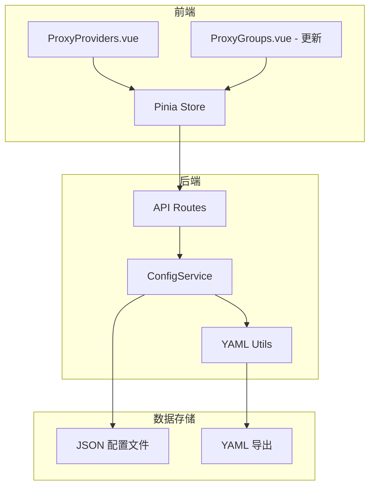
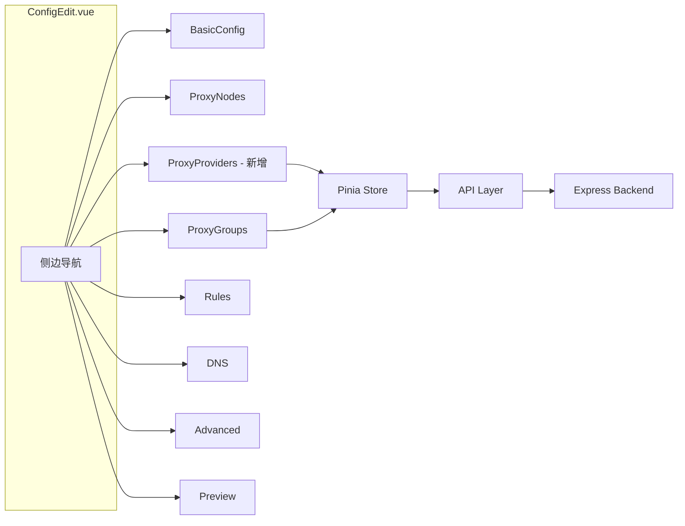

# Proxy-Provider 功能设计文档

## 1. 功能概述

为 Clash Configurator 添加 proxy-provider 支持，允许用户从外部源（HTTP URL 或本地文件）获取代理节点，支持自动更新和健康检查配置。

## 2. Clash proxy-provider 数据结构

### 2.1 HTTP Provider 示例

```yaml
proxy-providers:
  provider-name:
    type: http
    url: https://example.com/subscription
    interval: 3600
    path: ./profiles/proxy/provider-name.yaml
    health-check:
      enable: true
      url: http://www.gstatic.com/generate_204
      interval: 300
```

### 2.2 File Provider 示例

```yaml
proxy-providers:
  provider-name:
    type: file
    path: ./profiles/proxy/provider-name.yaml
    health-check:
      enable: true
      url: http://www.gstatic.com/generate_204
      interval: 300
```

### 2.3 完整数据模型

```javascript
{
  // provider 名称作为 key
  providerName: {
    type: 'http' | 'file',           // 必填：provider 类型
    
    // HTTP 类型必填
    url: String,                       // 订阅地址
    interval: Number,                  // 更新间隔（秒）
    
    // File 类型必填
    path: String,                      // 本地文件路径
    
    // 可选配置
    header: Object,                    // HTTP 请求头
    
    // 健康检查配置
    health-check: {
      enable: Boolean,
      url: String,                     // 健康检查 URL
      interval: Number                 // 检查间隔（秒）
    }
  }
}
```

## 3. 系统架构



## 4. 数据存储设计

### 4.1 JSON 配置结构扩展

在现有配置对象中添加 `proxy-providers` 字段：

```javascript
{
  id: String,
  name: String,
  // ... 现有字段
  
  // 新增：proxy-providers
  'proxy-providers': {
    providerName: {
      type: 'http',
      url: 'https://example.com/subscription',
      interval: 3600,
      path: './profiles/proxy/provider-name.yaml',
      health-check: {
        enable: true,
        url: 'http://www.gstatic.com/generate_204',
        interval: 300
      }
    }
  }
}
```

### 4.2 YAML 导出格式

导出时将 `proxy-providers` 字段正确输出到 YAML：

```yaml
mixed-port: 7890
# ... 其他配置
proxies:
  - name: node1
    type: vmess
    # ...
    
proxy-providers:
  my-provider:
    type: http
    url: https://example.com/subscription
    interval: 3600
    path: ./profiles/proxy/my-provider.yaml
    health-check:
      enable: true
      url: http://www.gstatic.com/generate_204
      interval: 300

proxy-groups:
  - name: PROXY
    type: select
    use:                    # 引用 provider
      - my-provider
    proxies:
      - node1
```

## 5. API 设计

### 5.1 新增 API 端点

| 方法 | 路径 | 描述 |
|------|------|------|
| GET | /api/configs/:id/providers | 获取所有 proxy-providers |
| POST | /api/configs/:id/providers | 添加 proxy-provider |
| PUT | /api/configs/:id/providers/:name | 更新指定 proxy-provider |
| DELETE | /api/configs/:id/providers/:name | 删除指定 proxy-provider |

### 5.2 API 请求/响应示例

**添加 Provider:**
```javascript
// POST /api/configs/:id/providers
// Request Body:
{
  name: 'my-provider',
  type: 'http',
  url: 'https://example.com/subscription',
  interval: 3600,
  path: './profiles/proxy/my-provider.yaml',
  health-check: {
    enable: true,
    url: 'http://www.gstatic.com/generate_204',
    interval: 300
  }
}

// Response:
{
  success: true,
  data: {
    'my-provider': { ... }
  }
}
```

## 6. 前端组件设计

### 6.1 新增组件：ProxyProviders.vue

```
┌─────────────────────────────────────────────────────┐
│ Proxy Providers                            [+ 添加] │
├─────────────────────────────────────────────────────┤
│ ┌─────────────────────────────────────────────────┐ │
│ │ my-provider                           [编辑][删除]│ │
│ │ 类型: HTTP | 更新间隔: 3600s                     │ │
│ │ URL: https://example.com/...                    │ │
│ │ 健康检查: ✓ 启用 | 间隔: 300s                    │ │
│ └─────────────────────────────────────────────────┘ │
│                                                     │
│ ┌─────────────────────────────────────────────────┐ │
│ │ local-provider                        [编辑][删除]│ │
│ │ 类型: File                                       │ │
│ │ 路径: ./profiles/proxy/local.yaml               │ │
│ │ 健康检查: ✗ 未启用                               │ │
│ └─────────────────────────────────────────────────┘ │
└─────────────────────────────────────────────────────┘
```

### 6.2 添加/编辑 Provider 对话框

```
┌─────────────────────────────────────────────────────┐
│ 添加 Proxy Provider                            [X] │
├─────────────────────────────────────────────────────┤
│ Provider 名称: [________________]                   │
│                                                     │
│ 类型: (•) HTTP  ( ) File                           │
│                                                     │
│ --- HTTP 配置 ---                                   │
│ 订阅地址: [________________________________]       │
│ 更新间隔: [3600] 秒                                │
│                                                     │
│ --- 文件配置 ---                                    │
│ 文件路径: [_______________________________]        │
│                                                     │
│ --- 健康检查 ---                                    │
│ [✓] 启用健康检查                                   │
│ 检查 URL: [http://www.gstatic.com/generate_204]   │
│ 检查间隔: [300] 秒                                 │
│                                                     │
│                          [取消]  [确定]            │
└─────────────────────────────────────────────────────┘
```

### 6.3 更新 ProxyGroups.vue

在代理组编辑表单中添加 Provider 选择：

```
┌─────────────────────────────────────────────────────┐
│ 代理组编辑                                          │
├─────────────────────────────────────────────────────┤
│ 名称: [PROXY________]                              │
│ 类型: [select ▼]                                   │
│                                                     │
│ 节点来源:                                           │
│ ┌─────────────────┐ ┌─────────────────┐            │
│ │ 手动选择节点     │ │ 引用 Provider   │            │
│ └─────────────────┘ └─────────────────┘            │
│                                                     │
│ 选择节点: [node1, node2, node3 ▼]                  │
│                                                     │
│ 引用 Provider:                                      │
│ [✓] my-provider                                    │
│ [ ] local-provider                                 │
│                                                     │
└─────────────────────────────────────────────────────┘
```

## 7. 实施步骤详解

### 步骤 1: 后端数据模型和验证

**文件**: `server/utils/yaml.js`

1. 更新 `validateClashConfig` 函数添加 proxy-providers 验证
2. 更新 `generateDefaultConfig` 函数添加空的 proxy-providers 字段

```javascript
// 验证 proxy-providers
if (config['proxy-providers'] && typeof config['proxy-providers'] === 'object') {
  Object.entries(config['proxy-providers']).forEach(([name, provider]) => {
    if (!provider.type) {
      errors.push(`Provider ${name} 缺少类型`);
    }
    if (provider.type === 'http' && !provider.url) {
      errors.push(`HTTP Provider ${name} 缺少 URL`);
    }
    if (provider.type === 'file' && !provider.path) {
      errors.push(`File Provider ${name} 缺少路径`);
    }
  });
}
```

### 步骤 2: 后端 API 路由扩展

**文件**: `server/routes/config.js`

添加以下路由处理函数：

```javascript
// 获取所有 proxy-providers
router.get('/:id/providers', async (req, res) => {
  // ...
});

// 添加 proxy-provider
router.post('/:id/providers', async (req, res) => {
  // ...
});

// 更新 proxy-provider
router.put('/:id/providers/:name', async (req, res) => {
  // ...
});

// 删除 proxy-provider
router.delete('/:id/providers/:name', async (req, res) => {
  // ...
});
```

### 步骤 3: 前端 Store 扩展

**文件**: `client/src/stores/config.js`

添加 proxy-providers 相关操作：

```javascript
// 状态
const providerNames = computed(() => {
  if (!currentConfig.value?.['proxy-providers']) return []
  return Object.keys(currentConfig.value['proxy-providers'])
})

// 方法
async function addProxyProvider(configId, provider) { }
async function updateProxyProvider(configId, providerName, provider) { }
async function deleteProxyProvider(configId, providerName) { }
```

### 步骤 4: 前端 API 扩展

**文件**: `client/src/api/config.js`

添加 API 调用函数：

```javascript
export function getProxyProviders(configId) { }
export function addProxyProvider(configId, provider) { }
export function updateProxyProvider(configId, name, provider) { }
export function deleteProxyProvider(configId, name) { }
```

### 步骤 5: 创建 ProxyProviders.vue 组件

**文件**: `client/src/views/config/ProxyProviders.vue`

实现完整的 proxy-provider 管理界面，包括：
- Provider 列表展示
- 添加/编辑对话框
- HTTP 和 File 类型的动态表单
- 健康检查配置

### 步骤 6: 更新 ProxyGroups.vue

**文件**: `client/src/views/config/ProxyGroups.vue`

修改内容：
1. 添加 `use` 字段支持
2. 在节点选择区域增加 Provider 多选
3. 提交时正确处理 `proxies` 和 `use` 字段

### 步骤 7: 更新路由和导航

**文件**: `client/src/router/index.js`

添加路由：

```javascript
{
  path: 'providers',
  name: 'ProxyProviders',
  component: () => import('@/views/config/ProxyProviders.vue'),
  meta: { title: 'Proxy Providers' }
}
```

**文件**: `client/src/views/ConfigEdit.vue`

在侧边导航中添加 Proxy Providers 入口。

### 步骤 8: 更新 YAML 导出

确保 `server/utils/yaml.js` 中的 `toYaml` 函数正确处理 `proxy-providers` 字段。

## 8. 组件关系图



## 9. 代理组数据结构变更

### 9.1 现有结构

```javascript
{
  name: 'PROXY',
  type: 'select',
  proxies: ['node1', 'node2', 'DIRECT']
}
```

### 9.2 扩展后结构

```javascript
{
  name: 'PROXY',
  type: 'select',
  proxies: ['node1', 'node2', 'DIRECT'],  // 手动选择的节点
  use: ['my-provider', 'local-provider']   // 引用的 provider
}
```

### 9.3 注意事项

- `proxies` 和 `use` 可以同时存在
- `use` 字段是 provider 名称的数组
- 导出 YAML 时，`use` 字段需要放在 `proxies` 之后

## 10. 测试计划

### 10.1 后端测试

1. Provider CRUD 操作
2. 配置验证逻辑
3. YAML 导出正确性

### 10.2 前端测试

1. Provider 添加/编辑/删除功能
2. HTTP 和 File 类型切换
3. 健康检查配置显示/隐藏
4. 代理组中 Provider 选择
5. YAML 预览正确性

---

**文档版本**: 1.0  
**创建时间**: 2024-03-12  
**相关文档**: [architecture.md](./architecture.md)