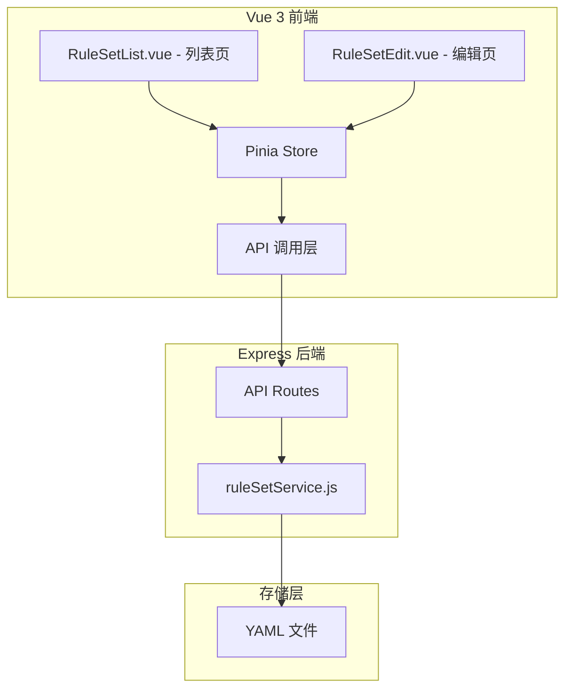
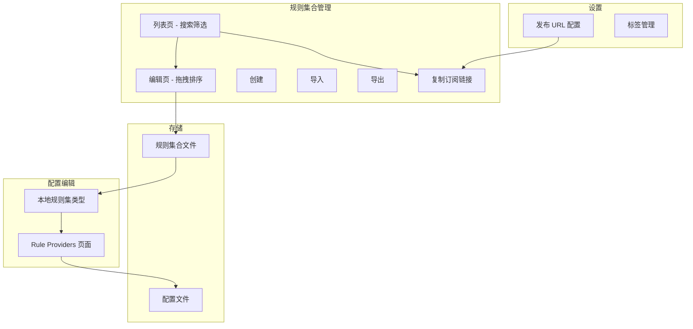

# 规则集合（Rule-Set）功能设计文档

## 1. 功能概述

为 Clash Configurator 添加独立的「规则集合文件」管理功能，与配置（config）管理平行。用户可以创建、编辑、导出独立的规则集合文件，这些文件可以被 Clash 的 rule-provider 引用。

## 2. 背景：Clash 规则集合格式

### 2.1 Classical 模式（经典模式）

完整的规则格式，支持所有规则类型。**注意：根据 Clash Meta 规范，规则中的策略字段会被忽略，实际策略由配置文件中 rule-provider 的使用方式决定。**

```yaml
payload:
  - DOMAIN-SUFFIX,google.com
  - DOMAIN-KEYWORD,facebook
  - IP-CIDR,1.1.1.1/32
  - SRC-IP-CIDR,192.168.1.0/24
  - GEOIP,CN
  - DST-PORT,80
  - PROCESS-NAME,chrome.exe
```

### 2.2 Domain 模式（域名模式）

仅域名规则，简化格式：

```yaml
payload:
  - google.com
  - example.com
  - '*.example.org'
```

导出后自动转换为：
```yaml
payload:
  - DOMAIN,google.com
  - DOMAIN,example.com
  - DOMAIN-SUFFIX,example.org
```

### 2.3 IPCIDR 模式（IP 模式）

仅 IP/CIDR 规则：

```yaml
payload:
  - 1.1.1.1/32
  - 192.168.0.0/16
  - 10.0.0.0/8
```

## 3. 数据模型设计

### 3.1 规则集合数据结构

```javascript
{
  id: String,                    // 规则集合 ID（UUID）
  name: String,                  // 规则集合名称
  behavior: String,              // 行为模式: classical/domain/ipcidr
  payload: Array,                // 规则列表
  description: String,           // 描述信息（可选）
  tags: Array,                   // 标签列表（可选）
  createdAt: Date,               // 创建时间
  updatedAt: Date                // 更新时间
}
```

**注意：** 根据 Clash Meta 规范，规则集不需要 `targetPolicy` 字段。策略是在配置文件中引用 rule-provider 时指定的。

### 3.2 存储格式

文件存储在 `server/data/rule-sets/` 目录下，使用 YAML 格式：

```yaml
# Rule Set Metadata
# id: xxx-xxx-xxx
# name: google-services
# behavior: classical
# description: Google 服务规则
# tags: ["google","services"]
# createdAt: 2024-03-13T00:00:00.000Z
# updatedAt: 2024-03-13T00:00:00.000Z

payload:
  - DOMAIN-SUFFIX,google.com
  - DOMAIN-SUFFIX,youtube.com
  - DOMAIN-SUFFIX,gmail.com
```

## 4. 系统架构



## 5. API 设计

### 5.1 规则集合管理 API

| 方法 | 路径 | 描述 |
|------|------|------|
| GET | /api/rule-sets | 获取所有规则集合列表 |
| POST | /api/rule-sets | 创建新规则集合 |
| GET | /api/rule-sets/:id | 获取指定规则集合详情 |
| PUT | /api/rule-sets/:id | 更新指定规则集合 |
| DELETE | /api/rule-sets/:id | 删除指定规则集合 |
| GET | /api/rule-sets/:id/export | 导出规则集合为 YAML 文件 |
| POST | /api/rule-sets/import | 导入规则集合文件 |
| POST | /api/rule-sets/validate | 验证规则格式 |

### 5.2 API 请求/响应示例

**创建规则集合：**
```javascript
// POST /api/rule-sets
// Request Body:
{
  name: 'google-services',
  behavior: 'classical',
  description: 'Google 服务规则',
  targetPolicy: 'PROXY',
  payload: [
    'DOMAIN-SUFFIX,google.com,PROXY',
    'DOMAIN-SUFFIX,youtube.com,PROXY'
  ]
}

// Response:
{
  success: true,
  data: {
    id: 'xxx-xxx-xxx',
    name: 'google-services',
    behavior: 'classical',
    payload: [...],
    createdAt: '2024-03-13T00:00:00.000Z',
    updatedAt: '2024-03-13T00:00:00.000Z'
  }
}
```

## 6. 前端组件设计

### 6.1 规则集合列表页 - RuleSetList.vue

```
┌─────────────────────────────────────────────────────────────────────┐
│ 规则集合                                        [+ 新建] [导入]     │
├─────────────────────────────────────────────────────────────────────┤
│ ┌─────────────────────────────────────────────────────────────────┐ │
│ │ google-services                           classical   [编辑][删除]│ │
│ │ 描述: Google 服务规则                                            │ │
│ │ 规则数: 15 条 | 默认策略: PROXY                                  │ │
│ │ 更新于: 2024-03-13 10:30                                        │ │
│ └─────────────────────────────────────────────────────────────────┘ │
│                                                                     │
│ ┌─────────────────────────────────────────────────────────────────┐ │
│ │ china-domains                             domain      [编辑][删除]│ │
│ │ 描述: 中国常用域名                                               │ │
│ │ 规则数: 50 条                                                    │ │
│ │ 更新于: 2024-03-12 15:20                                        │ │
│ └─────────────────────────────────────────────────────────────────┘ │
└─────────────────────────────────────────────────────────────────────┘
```

### 6.2 规则集合编辑页 - RuleSetEdit.vue

```
┌─────────────────────────────────────────────────────────────────────┐
│ ← 返回列表                      编辑规则集: google-services         │
├─────────────────────────────────────────────────────────────────────┤
│                                                                     │
│ 基本信息                                                             │
│ ┌─────────────────────────────────────────────────────────────────┐ │
│ │ 名称: [google-services_______]                                   │ │
│ │ 描述: [Google 服务规则_________________________________]         │ │
│ │ 行为模式: [classical ▼]                                          │ │
│ │ 默认策略: [PROXY ▼] (classical 模式专用)                         │ │
│ └─────────────────────────────────────────────────────────────────┘ │
│                                                                     │
│ 规则列表                                          [+ 添加规则]      │
│ ┌─────────────────────────────────────────────────────────────────┐ │
│ │ ┌─────────────────────────────────────────────────────────────┐ │ │
│ │ │ DOMAIN-SUFFIX,google.com,PROXY                     [删除]   │ │ │
│ │ ├─────────────────────────────────────────────────────────────┤ │ │
│ │ │ DOMAIN-SUFFIX,youtube.com,PROXY                    [删除]   │ │ │
│ │ ├─────────────────────────────────────────────────────────────┤ │ │
│ │ │ DOMAIN-SUFFIX,gmail.com,PROXY                      [删除]   │ │ │
│ │ └─────────────────────────────────────────────────────────────┘ │ │
│ └─────────────────────────────────────────────────────────────────┘ │
│                                                                     │
│ 批量添加                                                             │
│ ┌─────────────────────────────────────────────────────────────────┐ │
│ │ [每行一条规则，例如: DOMAIN-SUFFIX,google.com,PROXY           ] │ │
│ │ [                                                             ] │ │
│ │ [__________________________________________] [添加到列表]       │ │
│ └─────────────────────────────────────────────────────────────────┘ │
│                                                                     │
│                                           [预览 YAML] [保存] [导出] │
└─────────────────────────────────────────────────────────────────────┘
```

### 6.3 添加规则对话框

```
┌─────────────────────────────────────────────┐
│ 添加规则                               [X]  │
├─────────────────────────────────────────────┤
│ 规则类型: [DOMAIN-SUFFIX ▼]                 │
│                                             │
│ 匹配内容: [google.com________________]      │
│                                             │
│ 目标策略: [PROXY ▼]                         │
│                                             │
│ 注: 目标策略可选，留空则使用默认策略        │
│                                             │
│ 规则预览: DOMAIN-SUFFIX,google.com,PROXY    │
│                                             │
│                       [取消]  [确定]        │
└─────────────────────────────────────────────┘
```

## 7. 实施步骤

### 步骤 1: 后端服务层

创建 `server/services/ruleSetService.js`，实现：
- 规则集合的 CRUD 操作
- YAML 文件读写
- 规则验证逻辑
- 导入/导出功能

### 步骤 2: 后端路由

创建 `server/routes/rule-sets.js`，实现 API 端点：
- GET /api/rule-sets
- POST /api/rule-sets
- GET /api/rule-sets/:id
- PUT /api/rule-sets/:id
- DELETE /api/rule-sets/:id
- GET /api/rule-sets/:id/export
- POST /api/rule-sets/import

### 步骤 3: 前端 API 层

在 `client/src/api/` 创建 `ruleSet.js`，实现 API 调用函数。

### 步骤 4: 前端 Store

在 `client/src/stores/` 创建 `ruleSet.js`，实现状态管理。

### 步骤 5: 前端页面组件

创建以下组件：
- `client/src/views/RuleSetList.vue` - 规则集合列表页
- `client/src/views/RuleSetEdit.vue` - 规则集合编辑页

### 步骤 6: 路由和导航

更新 `client/src/router/index.js` 添加路由。
更新 `client/src/layouts/MainLayout.vue` 添加导航菜单。

## 8. 目录结构更新

```
clash-config-gen/
├── server/
│   ├── data/
│   │   ├── configs/           # 现有：配置文件
│   │   └── rule-sets/         # 新增：规则集合文件
│   ├── routes/
│   │   ├── config.js          # 现有
│   │   └── rule-sets.js       # 新增
│   └── services/
│       ├── configService.js   # 现有
│       └── ruleSetService.js  # 新增
│
├── client/src/
│   ├── api/
│   │   ├── config.js          # 现有
│   │   └── ruleSet.js         # 新增
│   ├── stores/
│   │   ├── config.js          # 现有
│   │   └── ruleSet.js         # 新增
│   └── views/
│       ├── ConfigList.vue     # 现有
│       ├── ConfigEdit.vue     # 现有
│       ├── RuleSetList.vue    # 新增
│       └── RuleSetEdit.vue    # 新增
```

## 9. 规则类型支持

### 9.1 Classical 模式支持的规则类型

| 类型 | 格式 | 示例 |
|------|------|------|
| DOMAIN | DOMAIN,域名,策略 | DOMAIN,google.com,PROXY |
| DOMAIN-SUFFIX | DOMAIN-SUFFIX,后缀,策略 | DOMAIN-SUFFIX,google.com,PROXY |
| DOMAIN-KEYWORD | DOMAIN-KEYWORD,关键词,策略 | DOMAIN-KEYWORD,google,PROXY |
| IP-CIDR | IP-CIDR,CIDR,策略 | IP-CIDR,1.1.1.1/32,PROXY |
| IP-CIDR6 | IP-CIDR6,CIDR6,策略 | IP-CIDR6,::1/128,PROXY |
| SRC-IP-CIDR | SRC-IP-CIDR,CIDR,策略 | SRC-IP-CIDR,192.168.1.0/24,DIRECT |
| GEOIP | GEOIP,国家代码,策略 | GEOIP,CN,DIRECT |
| GEOSITE | GEOSITE,站点集,策略 | GEOSITE,google,PROXY |
| DST-PORT | DST-PORT,端口,策略 | DST-PORT,80,PROXY |
| SRC-PORT | SRC-PORT,端口,策略 | SRC-PORT,7777,DIRECT |
| PROCESS-NAME | PROCESS-NAME,进程名,策略 | PROCESS-NAME,chrome.exe,PROXY |
| RULE-SET | RULE-SET,规则集名,策略 | RULE-SET,my-rules,PROXY |
| MATCH | MATCH,策略 | MATCH,PROXY |

### 9.2 Domain 模式

仅支持域名，格式简化：
- `google.com` → 自动转换为 `DOMAIN,google.com` 或 `DOMAIN-SUFFIX,google.com`
- `*.google.com` → 自动转换为 `DOMAIN-SUFFIX,google.com`

### 9.3 IPCIDR 模式

仅支持 IP/CIDR：
- `1.1.1.1/32`
- `192.168.0.0/16`
- `::1/128`

## 10. 与现有功能的集成

### 10.1 与 rule-providers 的关系

规则集合文件可以作为 rule-provider 的数据源：

```yaml
rule-providers:
  google-services:
    type: file
    behavior: classical
    path: ./rule-sets/google-services.yaml
```

### 10.2 未来扩展

1. 在配置编辑页面，可以引用已创建的规则集合
2. 支持规则集合的订阅和自动更新

## 11. 列表页搜索和筛选功能

### 11.1 搜索功能

```
┌─────────────────────────────────────────────────────────────────────┐
│ 规则集合                                        [+ 新建] [导入]     │
├─────────────────────────────────────────────────────────────────────┤
│ 搜索: [________________________] [搜索]                            │
│ 筛选: 行为模式 [全部 ▼]  标签 [全部 ▼]                             │
├─────────────────────────────────────────────────────────────────────┤
│ ... 规则集合列表 ...                                                │
└─────────────────────────────────────────────────────────────────────┘
```

搜索范围：
- 规则集合名称
- 描述
- 标签
- 规则内容（可选）

### 11.2 筛选条件

| 筛选项 | 选项 |
|--------|------|
| 行为模式 | 全部 / Classical / Domain / IPCIDR |
| 标签 | 全部 / 已选标签列表 |
| 创建时间 | 全部 / 今天 / 本周 / 本月 |
| 规则数量 | 全部 / 小于10条 / 10-50条 / 大于50条 |

## 12. 规则拖拽排序功能

### 12.1 编辑页拖拽排序

使用 VueDraggable 实现规则的拖拽排序：

```vue
<draggable 
  v-model="rules" 
  item-key="id"
  handle=".drag-handle"
  animation="200"
>
  <template #item="{ element, index }">
    <div class="rule-item">
      <span class="drag-handle">⋮⋮</span>
      <span>{{ element }}</span>
      <el-button @click="removeRule(index)">删除</el-button>
    </div>
  </template>
</draggable>
```

### 12.2 批量操作

```
┌─────────────────────────────────────────────────────────────────────┐
│ 规则列表                                          [+ 添加规则]      │
│ [全选] [批量删除] [批量移动]                                        │
├─────────────────────────────────────────────────────────────────────┤
│ ┌─────────────────────────────────────────────────────────────────┐ │
│ │ [✓] ⋮⋮ DOMAIN-SUFFIX,google.com,PROXY               [删除]     │ │
│ │ [✓] ⋮⋮ DOMAIN-SUFFIX,youtube.com,PROXY              [删除]     │ │
│ │ [ ] ⋮⋮ DOMAIN-SUFFIX,gmail.com,PROXY                [删除]     │ │
│ └─────────────────────────────────────────────────────────────────┘ │
└─────────────────────────────────────────────────────────────────────┘
```

## 13. 规则分类/标签管理功能

### 13.1 数据模型扩展

```javascript
{
  id: String,
  name: String,
  behavior: String,
  payload: Array,
  tags: [                    // 新增：标签数组
    { name: 'Google', color: '#4285f4' },
    { name: '常用', color: '#34a853' }
  ],
  description: String,
  createdAt: Date,
  updatedAt: Date,
  targetPolicy: String
}
```

### 13.2 标签管理界面

**标签选择器：**
```
┌─────────────────────────────────────────────┐
│ 标签:                                       │
│ ┌─────────────────────────────────────────┐ │
│ │ [Google ×] [常用 ×] [AI ×]             │ │
│ │ [+ 添加标签]                            │ │
│ └─────────────────────────────────────────┘ │
│                                             │
│ 常用标签:                                   │
│ [Google] [AI] [社交媒体] [流媒体] [游戏]   │
└─────────────────────────────────────────────┘
```

**标签管理对话框：**
```
┌─────────────────────────────────────────────┐
│ 管理标签                              [X]  │
├─────────────────────────────────────────────┤
│ 现有标签:                                   │
│ ┌─────────────────────────────────────────┐ │
│ │ Google      [编辑] [删除]               │ │
│ │ AI          [编辑] [删除]               │ │
│ │ 社交媒体     [编辑] [删除]               │ │
│ │ 流媒体      [编辑] [删除]               │ │
│ └─────────────────────────────────────────┘ │
│                                             │
│ [+ 创建新标签]                              │
│                                             │
│                       [关闭]                │
└─────────────────────────────────────────────┘
```

### 13.3 标签数据结构

```javascript
// 全局标签列表存储在 settings 中
{
  ruleSetTags: [
    { id: 'tag-1', name: 'Google', color: '#4285f4', count: 5 },
    { id: 'tag-2', name: 'AI', color: '#ea4335', count: 3 },
    { id: 'tag-3', name: '社交媒体', color: '#fbbc05', count: 2 },
    { id: 'tag-4', name: '流媒体', color: '#34a853', count: 4 }
  ]
}
```

### 13.4 标签 API 扩展

| 方法 | 路径 | 描述 |
|------|------|------|
| GET | /api/rule-sets/tags | 获取所有标签 |
| POST | /api/rule-sets/tags | 创建新标签 |
| PUT | /api/rule-sets/tags/:id | 更新标签 |
| DELETE | /api/rule-sets/tags/:id | 删除标签 |

### 13.5 列表页标签展示

```
┌─────────────────────────────────────────────────────────────────────┐
│ google-services                           classical   [编辑][删除]  │
│ 描述: Google 服务规则                                                │
│ 标签: [Google] [常用]                                                │
│ 规则数: 15 条 | 默认策略: PROXY | 更新于: 2024-03-13 10:30         │
└─────────────────────────────────────────────────────────────────────┘
```

## 14. 更新后的目录结构

```
clash-config-gen/
├── server/
│   ├── data/
│   │   ├── configs/           # 现有：配置文件
│   │   └── rule-sets/         # 新增：规则集合文件
│   ├── routes/
│   │   ├── config.js          # 现有
│   │   └── rule-sets.js       # 新增
│   └── services/
│       ├── configService.js   # 现有
│       ├── ruleSetService.js  # 新增
│       └── settingsService.js # 更新：添加标签管理
│
├── client/src/
│   ├── api/
│   │   ├── config.js          # 现有
│   │   └── ruleSet.js         # 新增
│   ├── components/
│   │   └── rule-set/          # 新增：规则集合组件
│   │       ├── RuleItem.vue       # 规则项组件（支持拖拽）
│   │       ├── TagSelector.vue    # 标签选择器
│   │       └── TagManager.vue     # 标签管理对话框
│   ├── stores/
│   │   ├── config.js          # 现有
│   │   └── ruleSet.js         # 新增
│   └── views/
│       ├── ConfigList.vue     # 现有
│       ├── ConfigEdit.vue     # 现有
│       ├── RuleSetList.vue    # 新增
│       └── RuleSetEdit.vue    # 新增
```

---

## 15. 复制发布链接功能

### 15.1 功能说明

规则集合文件将被同步到静态网站，用户可以配置发布 URL 前缀，然后一键复制规则集合的完整订阅链接。

### 15.2 设置页面配置

```
┌─────────────────────────────────────────────┐
│ 发布设置                                    │
├─────────────────────────────────────────────┤
│ 发布 URL 前缀:                              │
│ [https://www.example.com/rule___________]  │
│                                             │
│ 示例：                                      │
│ 规则集 private.yaml 的完整链接为：          │
│ https://www.example.com/rule/private.yaml  │
│                                             │
│                       [保存设置]            │
└─────────────────────────────────────────────┘
```

### 15.3 列表页复制链接

```
┌─────────────────────────────────────────────────────────────────────┐
│ google-services                           classical                  │
│ 描述: Google 服务规则                                                │
│ 规则数: 15 条                                                        │
│                                                                     │
│ [编辑] [导出] [复制订阅链接] [删除]                                  │
│       └─ 点击后复制: https://www.example.com/rule/google-services.yaml │
└─────────────────────────────────────────────────────────────────────┘
```

### 15.4 编辑页复制链接

在编辑页的操作按钮区添加「复制订阅链接」按钮：

```
│                                           [复制链接] [预览] [保存] [导出] │
└─────────────────────────────────────────────────────────────────────┘
```

### 15.5 数据模型扩展

在 settings 中添加发布 URL 配置：

```javascript
{
  // 现有设置...
  publishUrl: 'https://www.example.com/rule'
}
```

### 15.6 API 扩展

| 方法 | 路径 | 描述 |
|------|------|------|
| POST | /api/settings/publish-url | 设置发布 URL 前缀 |
| GET | /api/rule-sets/:id/publish-url | 获取规则集合的完整发布链接 |

## 16. Rule Provider 新类型：本地规则集

### 16.1 功能说明

在配置编辑的 rule-providers 页面，添加第三种类型「本地规则集」，用户可以从已创建的规则集合中选择一个，系统自动生成对应的 rule-provider 配置。

### 16.2 类型选择界面更新

```
┌─────────────────────────────────────────────┐
│ 类型: ( ) HTTP (订阅)                       │
│       ( ) File (本地文件)                   │
│       (•) 本地规则集 (从规则集合管理中选择) │
├─────────────────────────────────────────────┤
│ --- HTTP 配置 ---                           │
│ 订阅地址: [________________________]        │
│                                             │
│ --- File 配置 ---                           │
│ 文件路径: [________________________]        │
│                                             │
│ --- 本地规则集配置 ---                      │
│ 选择规则集: [google-services ▼]             │
│                                             │
│ 可用规则集:                                 │
│ • google-services (classical, 15条)        │
│ • china-domains (domain, 50条)             │
│ • private (classical, 10条)                │
└─────────────────────────────────────────────┘
```

### 16.3 生成的配置

选择本地规则集后，系统自动生成：

```yaml
rule-providers:
  google-services:
    type: file
    behavior: classical
    path: ./rule-sets/google-services.yaml
```

如果设置了发布 URL，还可以选择生成 HTTP 类型：

```yaml
rule-providers:
  google-services:
    type: http
    behavior: classical
    url: https://www.example.com/rule/google-services.yaml
    interval: 86400
```

### 16.4 RuleProviders.vue 更新

更新现有的 [`RuleProviders.vue`](client/src/views/config/RuleProviders.vue) 组件：

```vue
<el-form-item label="类型" prop="type">
  <el-radio-group v-model="providerForm.type" @change="onTypeChange">
    <el-radio value="http">HTTP (订阅)</el-radio>
    <el-radio value="file">File (本地文件)</el-radio>
    <el-radio value="local">本地规则集</el-radio>
  </el-radio-group>
</el-form-item>

<!-- 本地规则集选择 -->
<template v-if="providerForm.type === 'local'">
  <el-form-item label="选择规则集" prop="ruleSetId">
    <el-select v-model="providerForm.ruleSetId" placeholder="选择已创建的规则集">
      <el-option 
        v-for="rs in availableRuleSets" 
        :key="rs.id"
        :label="`${rs.name} (${rs.behavior}, ${rs.ruleCount}条)`"
        :value="rs.id"
      />
    </el-select>
  </el-form-item>
  
  <el-form-item label="生成方式">
    <el-radio-group v-model="providerForm.generateType">
      <el-radio value="file">File 类型</el-radio>
      <el-radio value="http" :disabled="!publishUrl">HTTP 类型</el-radio>
    </el-radio-group>
    <div class="form-tip" v-if="!publishUrl">
      HTTP 类型需要在设置中配置发布 URL
    </div>
  </el-form-item>
</template>
```

### 16.5 API 扩展

| 方法 | 路径 | 描述 |
|------|------|------|
| GET | /api/rule-sets/available | 获取可用规则集列表（简化版，用于选择器） |

### 16.6 数据流

```mermaid
graph LR
    A[规则集合管理] -->|创建| B[规则集合文件]
    B -->|存储| C[server/data/rule-sets/]
    
    D[Config 编辑] -->|添加 rule-provider| E[RuleProviders.vue]
    E -->|选择本地规则集| F[获取规则集列表]
    F -->|API 调用| G[/api/rule-sets/available]
    G -->|返回| H[规则集选项]
    
    E -->|保存| I[rule-providers 配置]
    I -->|生成| J[type: file 或 http]
```

## 17. 完整功能架构图



---

**文档版本**: 1.2  
**创建时间**: 2024-03-13  
**更新时间**: 2024-03-13  
**相关文档**: [architecture.md](./architecture.md), [proxy-provider-design.md](./proxy-provider-design.md)